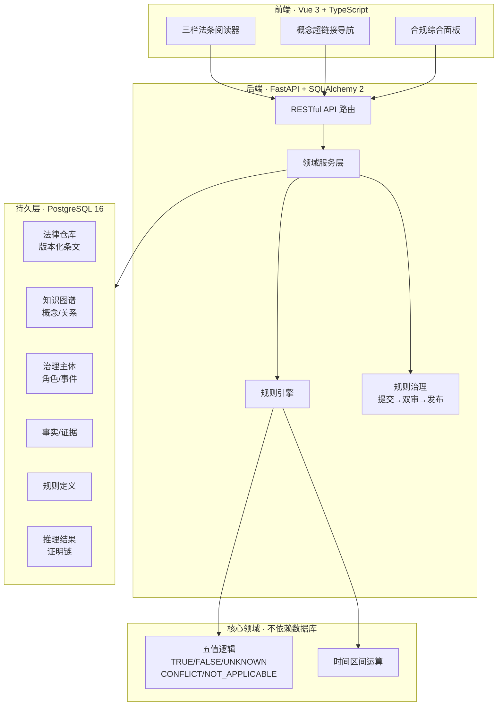

<a id="readme-top"></a>
<div align="center">

# ⚖️ LawFocus · 经济法知识图谱与合规推理系统

**将法律条文结构化为可计算的知识图谱，对上市公司治理合规性进行自动化形式推理，输出带完整证明链的五值逻辑判定。**

<p>
  
  
  
  
  
  
</p>

</div>

---

## 📖 目录

- [项目愿景与核心问题](#-项目愿景与核心问题)
- [系统架构](#-系统架构)
- [核心特性](#-核心特性)
- [技术栈](#️-技术栈)
- [快速开始](#-快速开始)
- [项目结构](#-项目结构)
- [测试](#-测试)
- [开发路线图](#️-开发路线图)
- [文档索引](#-文档索引)
- [许可证](#-许可证)

---

## 🌟 项目愿景与核心问题

### 痛点

- **法律条文非结构化**：上市公司治理涉及的法规散落于《公司法》《证券法》等多部法律中，条文之间的引用、时效变迁、概念定义关系难以人工追踪。
- **合规判定依赖经验**：独立董事比例是否达标？审计委员会是否依法设立？任职是否超期？——这些判定高度依赖人工逐条核对，易遗漏、难审计。
- **推理过程不可追溯**：传统合规检查给出"合规/不合规"结论，但缺少从法条 → 规则 → 事实 → 判定的完整证明链。

### 解决方案

LawFocus 将法律条文建模为**版本化知识图谱**，通过**形式化规则引擎**对上市公司治理事实进行自动推理，产出带完整证明链的**五值逻辑判定**（TRUE / FALSE / UNKNOWN / CONFLICT / NOT_APPLICABLE），并以三栏阅读器界面将法条、概念图谱和推理结果关联呈现。

---

## 🏗 系统架构



---

## ⚡ 核心特性

| 特性 | 说明 |
|---|---|
| **版本化法律仓库** | 法律条文按版本管理，支持时效溯源与跨版本对比，每份法源带哈希登记确保完整性 |
| **知识图谱建模** | 法律概念、关系、溯源边构成结构化图谱，概念间可导航跳转 |
| **五值逻辑推理引擎** | 超越简单布尔判定——当证据不足输出 UNKNOWN，当事实矛盾输出 CONFLICT，当主体类型不适用输出 NOT_APPLICABLE |
| **完整证明链** | 每条推理结论都附带从法条 → 规则 → 事实 → 判定的可审计推导链路 |
| **规则治理工作流** | 规则经历 DRAFT → 提交 → 法律审核 + 技术审核 → 发布 的完整治理流程 |
| **RBAC + 多租户隔离** | 8 种角色（Reader / ComplianceUser / KnowledgeEditor / LegalReviewer / TechnicalReviewer / Publisher / Auditor / SystemAdmin）+ 租户级数据隔离 |

---

## 🛠️ 技术栈

| 层次 | 技术选型 | 说明 |
|---|---|---|
| **后端框架** | FastAPI + Pydantic v2 | 异步 API + 严格类型校验 |
| **ORM / 迁移** | SQLAlchemy 2.0 + Alembic | 声明式模型 + 版本化数据库迁移 |
| **数据库** | PostgreSQL 16 | 支持 pgvector 扩展（预留向量检索能力） |
| **前端框架** | Vue 3 + Vite + TypeScript | Composition API + 热更新开发体验 |
| **状态管理** | Pinia + Vue Router | 轻量全局状态 + 路由管理 |
| **认证** | JWT (python-jose) + bcrypt | Token 认证 + 密码安全哈希 |
| **代码质量** | Ruff + mypy + ESLint + vue-tsc | 全栈静态分析与类型检查 |
| **测试** | pytest + Vitest | 后端 95 个测试 + 前端 7 个测试全绿 |

---

## 🚀 快速开始

### 前置要求

- PostgreSQL 16+
- Python 3.12+（推荐使用 [uv](https://docs.astral.sh/uv/)）
- Node.js 22+ / pnpm

### 安装与启动

```bash
# 1. 克隆仓库
git clone https://github.com/CHINGBOH/lawfocus.git
cd lawfocus

# 2. 安装前后端依赖
make bootstrap   # uv sync + pnpm install

# 3. 创建数据库
#    在 PostgreSQL 中执行：
#    CREATE ROLE lawfocus LOGIN PASSWORD 'lawfocus_dev_password';
#    CREATE DATABASE lawfocus_dev  OWNER lawfocus;
#    CREATE DATABASE lawfocus_test OWNER lawfocus;

# 4. 运行数据库迁移
make migrate

# 5. 灌入演示数据
LAWFOCUS_DEMO_PASSWORD='your_password' make seed

# 6. 启动开发服务器
make dev         # API → :8000 | Web → :5173
```

打开浏览器访问 `http://localhost:5173` 即可。

> 也可通过 `docker compose up` 启动（需要 Docker 环境）。

---

## 📁 项目结构

```text
lawfocus/
├── apps/
│   ├── api/                    # 后端服务
│   │   ├── app/
│   │   │   ├── api/            # API 路由 (v1)
│   │   │   ├── core/           # 配置与安全
│   │   │   ├── domain/         # 核心领域逻辑（五值逻辑 / 时间区间）
│   │   │   ├── models/         # SQLAlchemy 数据模型
│   │   │   │   ├── legal.py    # 法律仓库 / 版本
│   │   │   │   ├── graph.py    # 知识图谱（概念 / 关系）
│   │   │   │   ├── governance.py # 治理主体 / 角色 / 事件
│   │   │   │   ├── facts.py    # 事实 / 证据
│   │   │   │   ├── rules.py    # 规则定义
│   │   │   │   └── inference.py # 推理结果 / 证明链
│   │   │   ├── repositories/   # 数据访问层
│   │   │   ├── schemas/        # Pydantic 请求/响应模型
│   │   │   └── services/       # 业务服务（规则引擎 / 审计 / 授权）
│   │   ├── migrations/         # Alembic 数据库迁移
│   │   ├── scripts/            # 种子数据脚本
│   │   └── tests/              # 后端测试 (pytest)
│   └── web/                    # 前端应用
│       └── src/
│           ├── views/          # 页面视图（三栏阅读器）
│           ├── components/     # 可复用组件（概念超链接 / 合规面板）
│           ├── stores/         # Pinia 状态管理
│           ├── api/            # API 客户端
│           └── types/          # TypeScript 类型定义
├── contracts/                  # OpenAPI 契约导出
├── docs/                       # 项目文档
└── Makefile                    # 开发命令入口
```

---

## 🧪 测试

```bash
make test   # 后端 pytest + 前端 vitest
make lint   # ruff + mypy + eslint + vue-tsc
make e2e    # 端到端验收用例
```

---

## 🗺️ 开发路线图

- [x] 六层领域模型设计与数据库迁移
- [x] 10 条 P0 治理合规规则实现
- [x] 五值逻辑推理引擎 + 证明链输出
- [x] 规则治理工作流（提交 → 双审 → 发布）
- [x] RBAC 权限体系 + 多租户隔离
- [x] 三栏法条阅读器前端
- [x] 95 个后端测试 + 7 个前端测试全绿
- [ ] 首批真实法源采集与哈希登记
- [ ] 规则绑定正式法条并完成发布流程
- [ ] 接入真实 LLM Agent（已预留扩展点）
- [ ] 正式性能基准测试与容量验收

---

## 📚 文档索引

| 文档 | 说明 |
|---|---|
| [项目文档索引](docs/00-项目文档索引与实施顺序.md) | 全部设计文档的导航目录 |
| [法律体系概念图谱设计](docs/01-法律体系概念图谱设计.md) | 知识图谱本体与关系建模 |
| [学习工具产品需求](docs/02-学习工具产品需求与验收标准.md) | 产品需求规格与验收标准 |

---

## ⚠️ 免责声明

本仓库中的所有法律条文、规则与合规数据均为**合成演示数据**（标记 `DEMO` / `UNVERIFIED`），**不构成真实法律依据**。生产环境使用前，必须由法律专业人员完成真实法源的采集、核验与审核。

---

## 📄 许可证

本项目采用 [MIT License](LICENSE) 授权。

<p align="right"><a href="#readme-top">⬆ 回到顶部</a></p>
